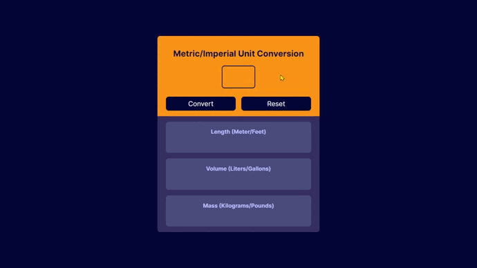

# Unit Convert - Solo Project



## *Requirements* :target:

🔳 Follow the design spec.

🔳 Generate all conversions when the user click "Convert".

🔳 Round the numbers down to three decimal places.

## *Screenshots* :camera:


## *Link* :link:

[Live Site URL](https://mendezpvi.github.io/fcp-unit-conversion/) 👀

## *I learnt...* :nerd_face:

✅ Remove arrows from `input[number]`

```css
input[type=number]::-webkit-inner-spin-button,
input[type=number]::-webkit-outer-spin-button {
  -webkit-appearance: none; 
  margin: 0;
}
input[type=number] { 
  -moz-appearance:textfield; 
  appearance:textfield; 
}
```

## *Author* :beginner:

✨ Frontend Mentor - [@mendezpvi](https://www.frontendmentor.io/profile/mendezpvi)